## POETIZE
POETIZE：作诗，有诗意地描写。

## 网站示例
[poetize.cn](https://poetize.cn)

这是我的个人网站，我的生活倒影，有诗意地记录自己的生活。

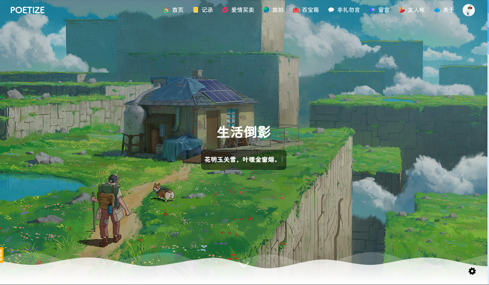

## Star
ps: 虽然我知道，大部分人都是来了直接下载源代码后就潇洒的离开。

虽然我知道现实就是如此的残酷，但我还是要以我萤虫之力对各位到来的同仁发出一声诚挚的嘶吼：`Star`，`Star`，`Star`

相信各位同仁看到下面的项目介绍一定会心动的，心想`怎么没有早点遇到这么漂亮的博客项目`。在搭建这个美丽的网站同时，何不`Star`，为这个项目点赞呢！

## 技术栈
前端技术：Vue 3.5.41、Vue Router 5.2.0、Vuex 4.1.0、Vite 8.2.2、Element Plus 2.14.5、Naive UI 2.45.2

后端技术：Java 25 LTS、Spring Boot 4.1.1、MySQL、MyBatis-Plus 3.5.17、t-io、Spring Mail

开发环境：Node.js 24.19 LTS、Maven 3.9+、JDK 25

## GitHub Release

推送 `v` 开头的标签后，GitHub Actions 会自动构建后端与两个前端，并创建包含 Linux x86-64 部署包和 SHA-256 校验文件的 Release：

```bash
git tag v2.0.3
git push poetize-new v2.0.3
```

Release 压缩包需要目标机安装 Java 25、MySQL 和 Nginx。压缩包内包含启动脚本、数据库初始化 SQL、Nginx 配置和 systemd 服务示例。

主站和聊天室会从浏览器存储中读取非空登录令牌。聊天室通过一次性登录票据建立会话；如果浏览器禁止写入存储，聊天室会清理内存中的登录状态并返回主站。两端的令牌处理可分别在 `poetize-ui` 和 `poetize-im-ui` 目录运行 `npm test` 验证，发布流程还会执行前端 lint、构建和后端 Maven 构建。

## 升级部署注意

- 新数据库仍带有公开的占位管理员散列。首次启动前必须设置环境变量 `POETRY_ADMIN_INITIAL_PASSWORD`，值至少 8 位并同时包含字母和数字；服务会在启动时将其转换为 BCrypt，未设置时会拒绝带弱默认密码启动。
- `sql/poetry.sql` 只负责新安装。已有数据库需在升级前清理用户名、手机号、邮箱、资源路径、好友关系和群成员关系中的重复数据，再补建脚本中的唯一索引；邮箱字段需迁移为 `varchar(254)`。
- 初始化脚本默认读取 `/home/poetry.sql`，非默认数据库名或其他部署目录请通过 `POETRY_DATABASE_INIT_SCRIPT` 指定自己的脚本。
- 生产环境前端默认使用同源 `/api`、`/im` 和 `/socket`，需配置相应反向代理；也可参考两个前端项目的 `.env.example` 显式覆盖地址。

## 项目地址
- 博客前端：https://gitee.com/littledokey/poetize-vue2.git
- 聊天室前端：https://gitee.com/littledokey/poetize-im-vue3.git
- 后端：https://gitee.com/littledokey/poetize-server.git
- 博客前端、聊天室前端、后端汇总版（上述三个仓库放在一个仓库里，代码无差别）：https://gitee.com/littledokey/poetize
- 网站介绍与更新记录：https://poetize.cn/article/20
- 部署文档和静态资源：https://poetize.cn/article/26

## 网站简介
这是一个 Spring Boot 4 + Vue 3 的产物，支持移动端自适应，配有完备的前台和后台管理功能。

网站分两个模块：
- 博客系统：具有文章，表白墙，图片墙，收藏夹，乐曲，视频播放，留言，友链，时间线，后台管理等功能。
- 聊天室系统：具有朋友圈（时间线），好友，群等功能。

本网站采用前后端分离进行实现，两个前端项目通过Nginx代理，后端使用Java。

启动网站需要安装Nginx、Java、MySQL，然后打包前后端项目并部署，详细部署流程请见[部署文档和静态资源：https://poetize.cn/article/26](https://poetize.cn/article/26)。

文件由后端保存到服务器本地目录，并通过 Nginx 提供访问。

IM 聊天室系统是非必须的。如果部署，则需要依赖博客，然后从博客的“联系我”进入，因为登录模块在博客。

## 网站示例（详细示例请见官方网站：[poetize.cn](https://poetize.cn)）
>网站介绍与更新记录请移步：[https://poetize.cn/article/20](https://poetize.cn/article/20)，后续更新将在这里记录与发布。

### 博客

#### 文章速览、文章分类
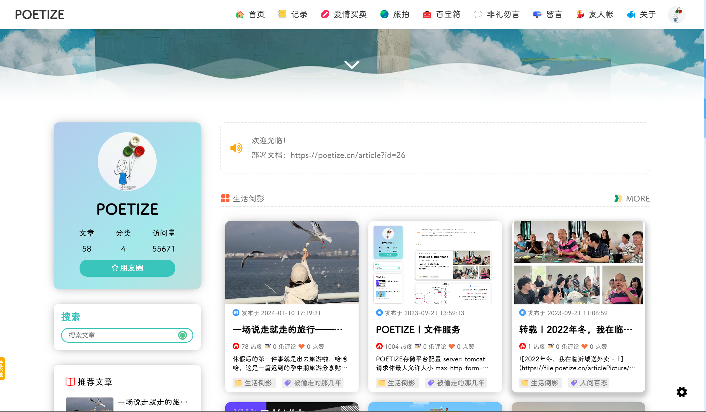

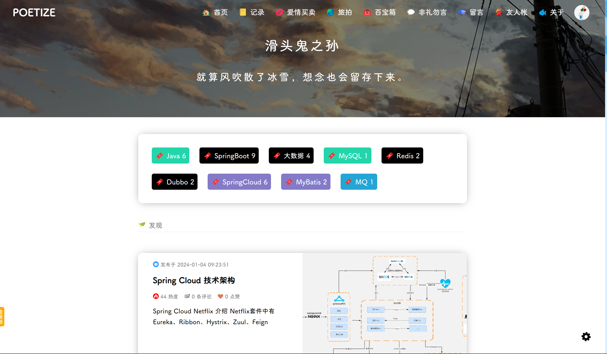

#### 文章详情页：文章、视频功能与留言
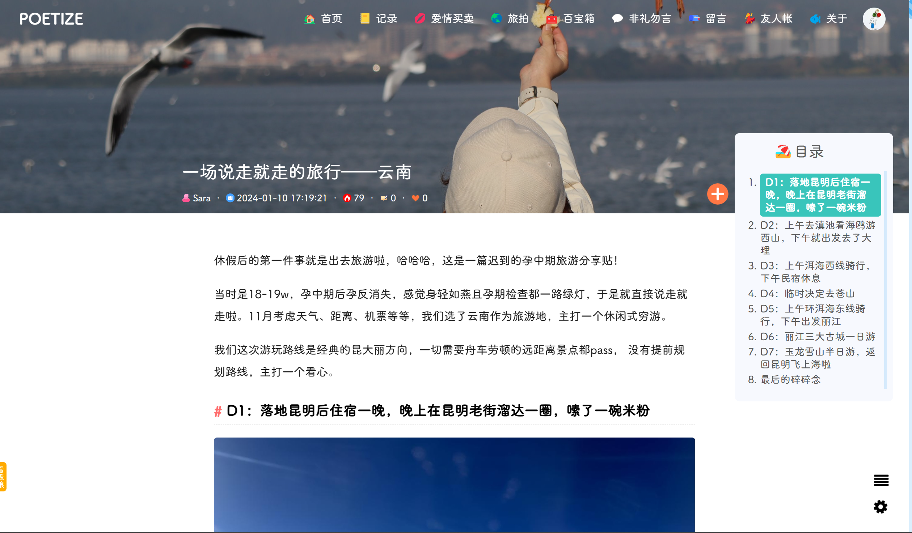

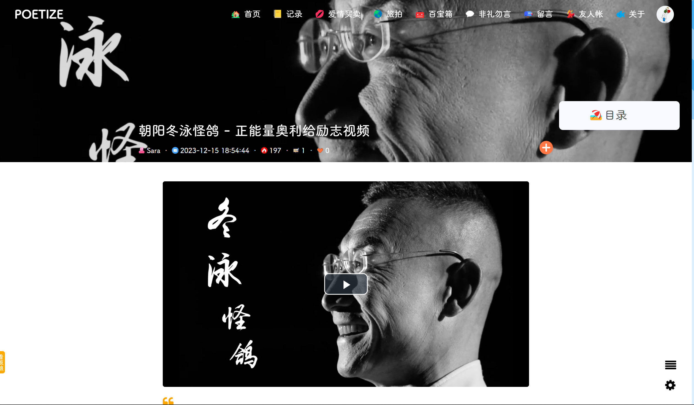

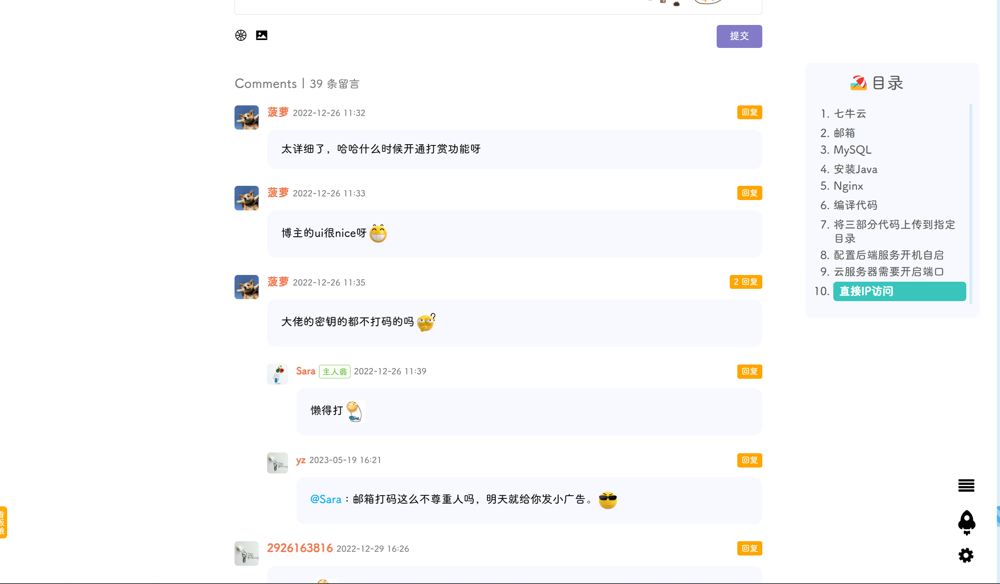

#### 恋爱笔记与旅拍


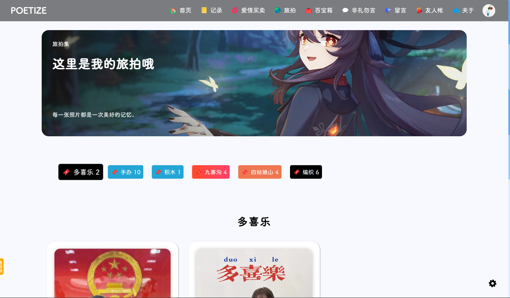

#### 百宝箱、弹幕墙与友人帐
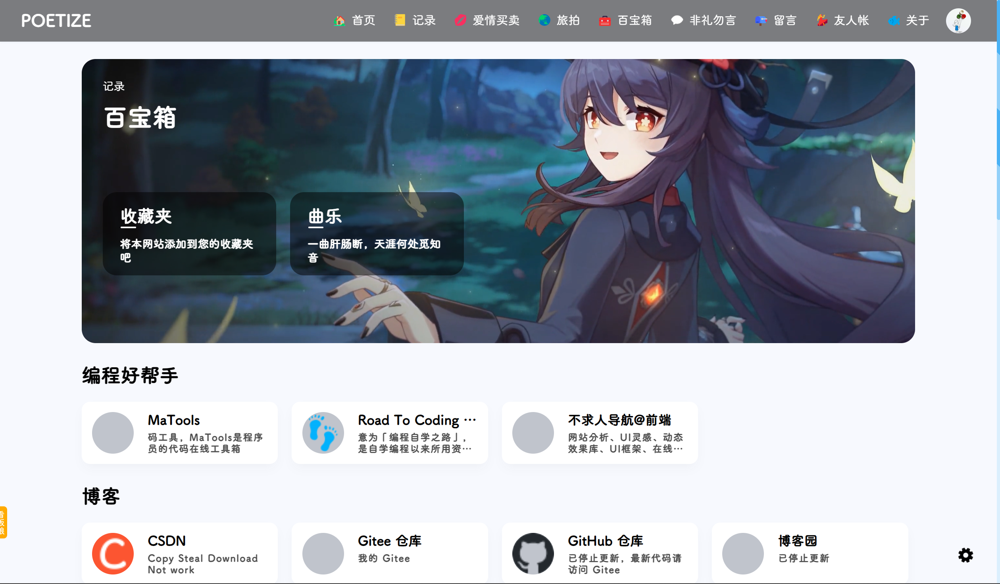

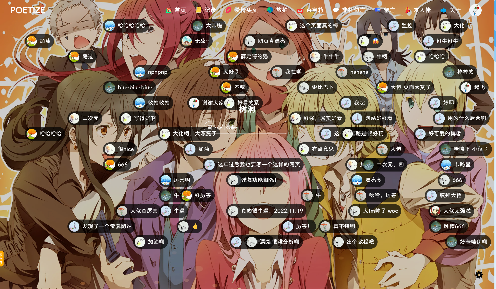

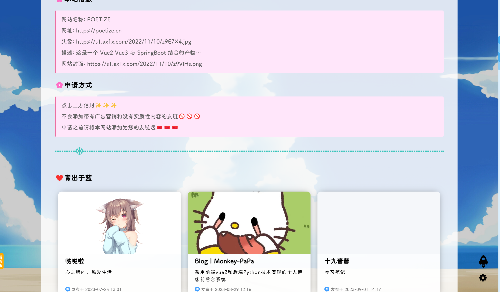

#### 聊天室与朋友圈
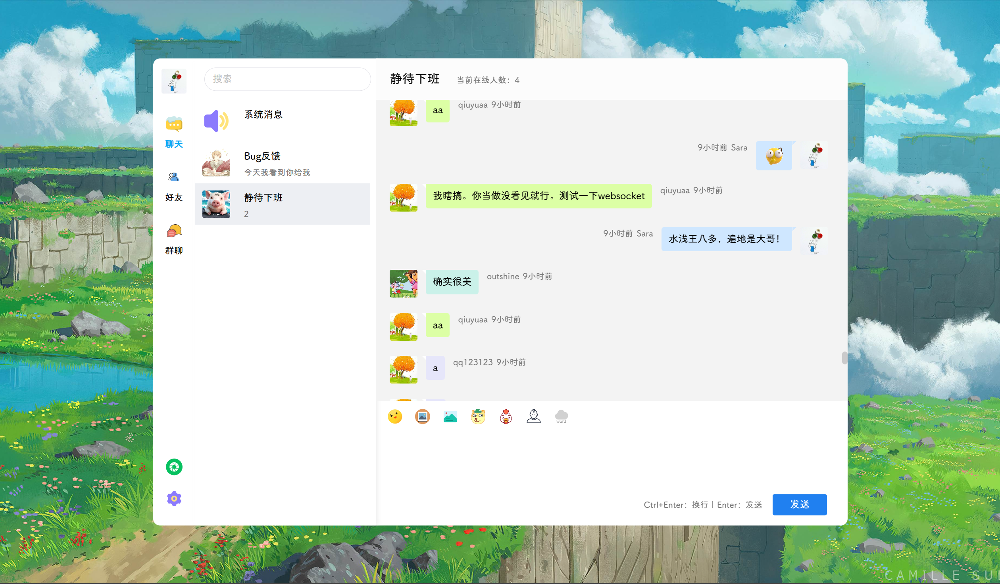

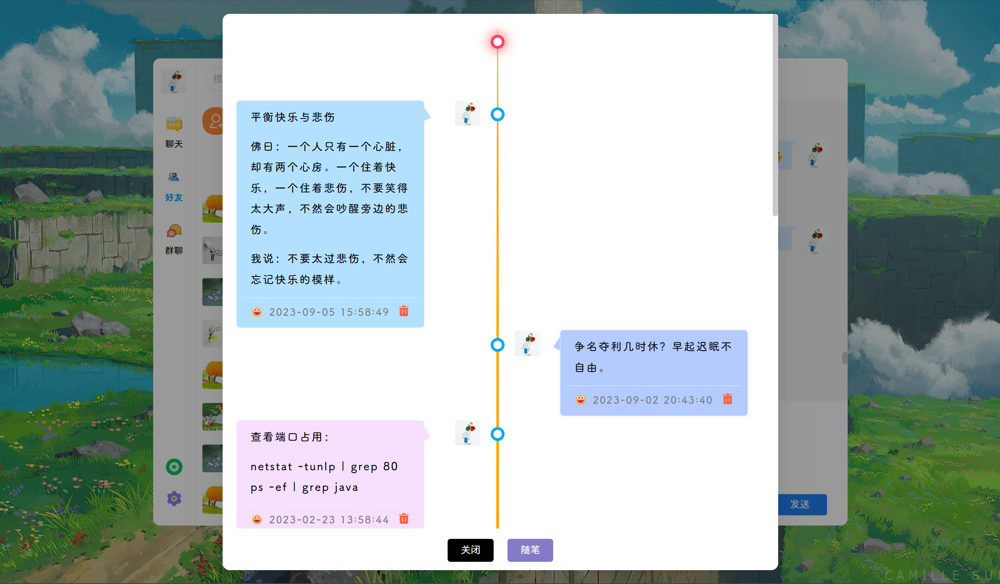

### 后台管理系统

#### 访问统计、基础设置与文件管理
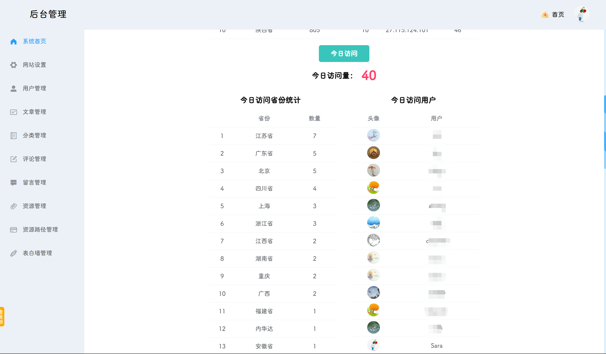

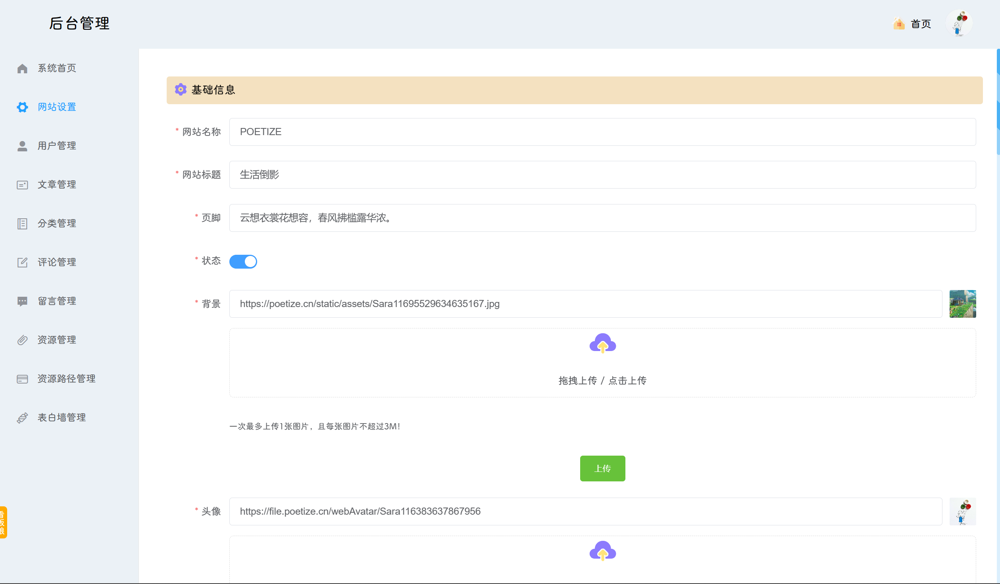

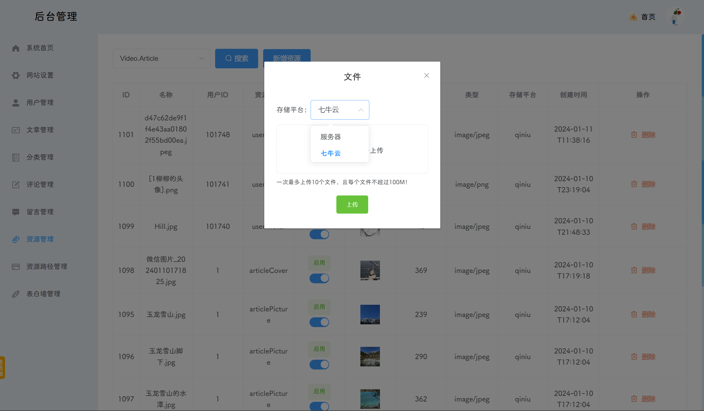

#### 文章管理与新增文章
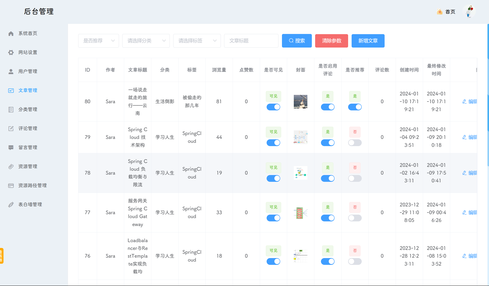

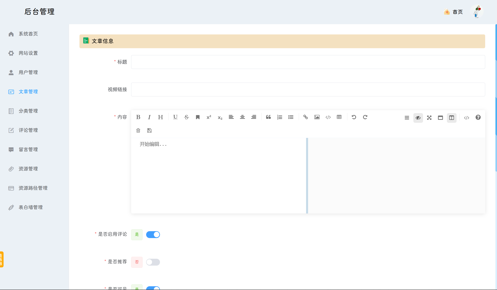

## 更新进度

### 2023年1月1日更新
- 新增：音乐盒功能
- 新增：表白墙功能
- 优化：文件管理
- 优化：登录支持多端登录
- 优化：登录权限过期时间重置
- 优化：前端美化
- 优化：留言分类与资源整合

### 2023年4月1日更新
- 新增：百宝箱（收藏夹）
- 优化：首页
- 优化：前端美化
- 优化：资源整合

### 2023年7月20日更新
- 新增：旅拍模块
- 新增：看板娘
- 优化：聊天室脚本过滤
- 优化：每个IP和账号限制每天接口保存次数
- 优化：Bug修复

### 2023年8月20日更新
- 新增：访客统计（博客首页展示总访问量，后台管理系统首页展示IP/地区/用户维度的访问统计）
- 新增：搜索（标题与内容匹配。标题匹配放在上面，内容匹配放在下面。匹配多个标题或者多个内容时间倒叙排列）
- 新增：音乐按照列表顺序播放，列表中最后一首歌播放完后停止
- 新增：聊天室搜索功能（搜索框下的内容筛选）
- 新增：后台管理系统【欢迎光临】
- 优化：前端美化
- 优化：个别Bug修复

### 2023年9月1日更新：安全，安全，安全
- 优化：所有保存接口、邮件发送接口、文件上传接口都限制次数，防止恶意调用
- 优化：修复vuex中用户信息丢失错乱的Bug
- 优化：文件上传模块改造，每次上传之前获取上传密钥，每个密钥只能上传一个文件
- 优化：个别Bug修复

### 2023年10月1日更新
- 新增：文章加密
- 新增：文章订阅
- 新增：文件上传模块改造，支持多平台（目前对接本地）
- 优化：友人帐及其他模块样式调整

### 2024年1月10日更新
- 新增：首页分类预览
- 新增：文章视频
- 新增：文章目录
- 新增：留言与朋友圈图片放大
- 新增：上传进度条与原始文件名记录
- 优化：百宝箱及其他模块样式调整

### 2024年4月1日更新
- 部署优化，提取配置文件到MySQL，无需编译打包环节
- 前端编译压缩，提升访问速度
- 部分样式美化

### 2024年4月10日更新
- 部署优化
- 后端增加系统配置模块
- 部分样式美化

========================================================================

## 作者微信号：poetize-sara
- 接收付费服务（定制开发、部署）
- 接收毕业设计指导

## 开源不易，欢迎赞助这个项目维持网站运行，您将获得[部署文档和静态资源：https://poetize.cn/article/26](https://poetize.cn/article/26)

## 欢迎关注作者B站
B站搜索用户【寻国记】。

【挑战最美博客！个人博客网站食用教程。这是一个 Spring Boot 4 与 Vue 3 的产物，在此公开，一起学习，共同成长。】
https://www.bilibili.com/video/BV1eM41167Ks/?share_source=copy_web
